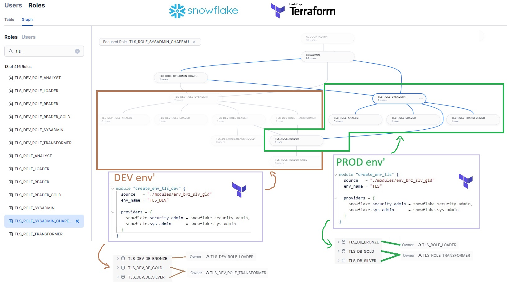

# Infra As Code & Snowflake

🎯 Goal : **Infra as Code** with Terraform

- for dev / prod environnements (db / schema / wh)
- for **role** creations & **grants** to db / schema / wh


🎓 Ressources IaC

- Mistertemp : [article IaC & Snow](https://tech.mistertemp.com/infra-as-code-avec-snowflake-ab961dd4d190?gi=a9060ed6cd68) (img up there 👆)
- ❄️ quickstart : [terraforming snowflake](https://quickstarts.snowflake.com/guide/terraforming_snowflake/index.html) ([github demo](https://github.com/Snowflake-Labs/sfguide-terraform-sample)) ✅
- ❄️ Github : [Snowflake-Labs/terraform-provider-snowflake](https://github.com/Snowflake-Labs/terraform-provider-snowflake) > [examples](https://github.com/Snowflake-Labs/terraform-provider-snowflake/tree/main/examples)
- [Install terraform](https://developer.hashicorp.com/terraform/install)

🎓 Ressources Snowflake Roles & Grants

- dbt doc :  [Snowflake ❄️ permissions](https://docs.getdbt.com/reference/database-permissions/snowflake-permissions)
- dbt blog :  [Setting up Snowflake ❄️ — the exact grant statements we run](https://discourse.getdbt.com/t/setting-up-snowflake-the-exact-grant-statements-we-run/439)
- 🦫 CastorDoc : [dbt & snowflake ❄️](https://www.castordoc.com/blog/dbt-snowflake)

## 🎯 Target Architecture

### environnments: `dev` | `val` | `prod`

in each env', we have the 3 following database & schemas

- 🥉 `{env}_db_bronze`
  - `sage_x3_cdc`
  - `sage_x3_full`
  - ...
- 🥈 `{env}_db_silver`
  - schemas created by dbt
- 🥇 `{env}_db_gold`
  - schemas created by dbt

### 🎯 Roles

- **loader** : usr kafka_debezium (dev / prod)\
  can create/drop schemas & tables in db_bronze
  - 🖥️ `loader_warehouse`
- **transformer** : usr dbt_runner (dev / prod)\
  can create/drop schemas & tables in db_silver & db_gold
  - 🖥️ `transformer_warehouse`
- **analyst** : can create/drop schemas & tables on all db\
  **ONLY** on dev env'
  - 🖥️ `analyst_warehouse`
- **reader** : can read everywhere
  - 🖥️ `reader_warehouse`
  - **reader_gold** : can read gold layers only

### 🪖 Admin roles in Snowflake ❄️

- **userAdmin** : add user & adjust ssh public key
- **securityAdmin** : grant privileges (user to group, object to group, group to group ...)
- **sysAdmin** : can delete/create all objects\
  all object roles must have sysAdmin as a parent
- **accountAdmin** : parent de userAdmin, securityAdmin, sysAdmin\
  ~ Dieu 😎 => n'utiliser qu'en extrème urgence #drop

## Summary

note: **dev reader & transformer** need **prod reader** role :) #deferToProd


~ sous le **capot** 🚘


## Setup & useful commands

### Setup & install

- [Install terraform](https://developer.hashicorp.com/terraform/install)
- have your snowflake admin account .ssh keys ready & adjust paths in `main.tf`

#### ssh setup & snowflake

```bash
# setup ssh key for your service account
ssh-keygen -t rsa -b 2048 -m pkcs8 -C "agiraud_snow" -f key_agiraud_snowflake
# show the public key to setup in snowflake (special format required)
ssh-keygen -e -f .\key_agiraud_snowflake.pub -m pkcs8
# copy past it in rsa_public_key
```

```sql
-- in snowflake
use role USERADMIN;
alter user AGIRAUDEMO set rsa_public_key_2='3QIDAQAB';
```

### useful commands

- `terraform init` to install project depedencies
- `terraform plan` to plan the deployment
- `terraform apply` to deploy to target
- `terraform destroy` 🧨

commandes plus avancées

- renommer une ressource
  - `terraform stave mv type.premier_nom type.second_nom`
  - autre option : dans le code .tf `moved {from = type.premier_nom to type.second_nom}`
- dire à terraform qu'il n'a plus à "maintenir" une ressource données
  - `terraform stave rm type.nom_ressource`
- une ressource exite déjà, je veux désormais la gérer avec terraform
  - `terraform import aws_s3_bucket.bucket bucket-name`
- `terraform state list`
