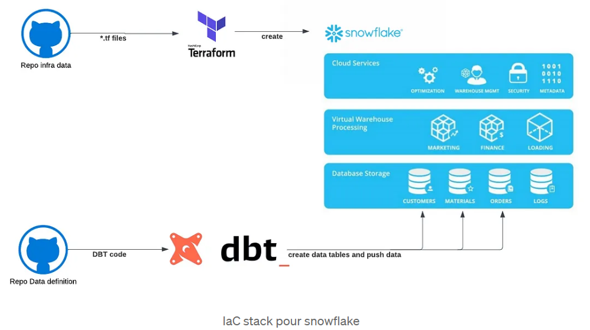

# Infra As Code & Snowflake

🎯 Goal : **Infra as Code** with Terraform

- for dev / prod environnements (db / schema / wh)
- for **role** creations & **grants** to db / schema / wh



🎓 Ressources IaC

- Mistertemp : [article IaC & Snow](https://tech.mistertemp.com/infra-as-code-avec-snowflake-ab961dd4d190?gi=a9060ed6cd68) (img up there 👆)
- ❄️ quickstart : [terraforming snowflake](https://quickstarts.snowflake.com/guide/terraforming_snowflake/index.html) ([github demo](https://github.com/Snowflake-Labs/sfguide-terraform-sample)) ✅
- ❄️ Github : [Snowflake-Labs/terraform-provider-snowflake](https://github.com/Snowflake-Labs/terraform-provider-snowflake) > [examples](https://github.com/Snowflake-Labs/terraform-provider-snowflake/tree/main/examples)
- [Install terraform](https://developer.hashicorp.com/terraform/install)

🎓 Ressources Snowflake Roles & Grants

- dbt doc :  [Snowflake ❄️ permissions](https://docs.getdbt.com/reference/database-permissions/snowflake-permissions)
- dbt blog :  [Setting up Snowflake ❄️ — the exact grant statements we run](https://discourse.getdbt.com/t/setting-up-snowflake-the-exact-grant-statements-we-run/439)
- 🦫 CastorDoc : [dbt & snowflake ❄️](https://www.castordoc.com/blog/dbt-snowflake)

## 🎯 Target Architecture

### environnments: 

1 db : alias
3 shemas : 🥉🥈🥇

### 🎯 Roles

- **admin** (granted to sysadmin)
  - **loader**       using 💻 `loading_wh`      owns 🥉 bonze schemas
  - **transformer**  using 💻 `transforming_wh` owns 🥈 silver & 🥇 gold schemas
    - **reader**     using 💻 `reading_wh`      reads all schemas 🥉🥈🥇

### 🪖 Admin roles in Snowflake ❄️

- **userAdmin** : add user & adjust ssh public key
- **securityAdmin** : grant privileges (user to group, object to group, group to group ...)
- **sysAdmin** : can delete/create all objects\
  all object roles must have sysAdmin as a parent
- **accountAdmin** : parent de userAdmin, securityAdmin, sysAdmin\
  ~ Dieu 😎 => n'utiliser qu'en extrème urgence #drop

## Setup & useful commands

### Setup & install

- [Install terraform](https://developer.hashicorp.com/terraform/install)
- initialize `env.tfvars`

#### ssh setup & snowflake

```bash
# setup ssh key for your service account
ssh-keygen -t rsa -b 2048 -m pkcs8 -C "USR_TERRAFORM" -f key_USR_TERRAFORM_snowflake
# show the public key to setup in snowflake (special format required)
ssh-keygen -e -f .\key_USR_TERRAFORM_snowflake.pub -m pkcs8
# copy past it in rsa_public_key
```

```sql
-- in snowflake
use role USERADMIN;
alter user USR_TERRAFORM set rsa_public_key_2='3QIDAQAB';
```

### useful commands

- `terraform init` to install project depedencies
- `terraform plan -var-file="env/.tfvars"` to plan the deployment
- `terraform apply -var-file="env/.tfvars"` to deploy to target
- `terraform destroy -var-file="env/.tfvars"` 🧨

### commandes avancées

- renommer une ressource
  - `terraform state mv type.premier_nom type.second_nom`
  - autre option : dans le code .tf `moved {from = type.premier_nom to type.second_nom}`
- dire à terraform qu'il n'a plus à "maintenir" une ressource données
  - `terraform state rm type.nom_ressource`
- une ressource exite déjà, je veux désormais la gérer avec terraform
  - `terraform import aws_s3_bucket.bucket bucket-name`
- `terraform state list`
