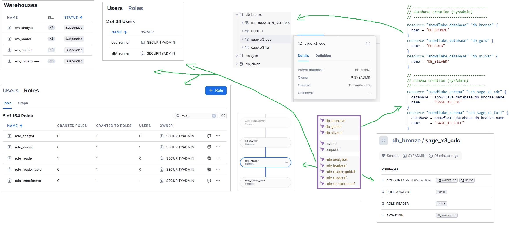

## Archi CIBLE 🎯

### environnments: `dev` | `val` | `prod`

in each env', we have the 3 following database & schemas

- 🥉 `{env}_db_bronze`
  - `sage_x3_cdc`
  - `sage_x3_full`
  - ...
- 🥈 `{env}_db_silver`
  - schemas created by dbt
- 🥇 `{env}_db_gold`
  - schemas created by dbt

### 🎯 Roles

- **loader** : usr kafka_debezium (dev / prod)\
  can create/drop schemas & tables in db_bronze
  - 🖥️ `loader_warehouse`
- **transformer** : usr dbt_runner (dev / prod)\
  can create/drop schemas & tables in db_silver & db_gold
  - 🖥️ `transformer_warehouse`
- **analyst** : can create/drop schemas & tables on all db\
  **ONLY** on dev env'
  - 🖥️ `analyst_warehouse`
- **reader** : can read everywhere
  - 🖥️ `reader_warehouse`
  - **reader_gold** : can read gold layers only

### 🪖 Admin roles

- **userAdmin** : add user & adjust ssh public key
- **securityAdmin** : grant privileges (user to group, object to group, group to group ...)
- **sysAdmin** : can delete/create all objects\
  all object roles must have sysAdmin as a parent
- **accountAdmin** : parent de userAdmin, securityAdmin, sysAdmin\
  ~ Dieu 😎 => n'utiliser qu'en extrème urgence #drop

## récap

